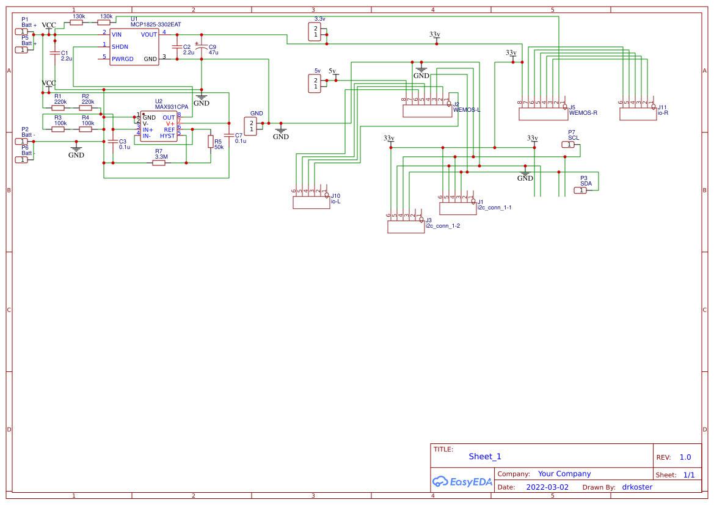
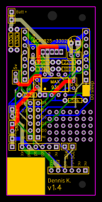

# PCB-Sensor-Proto-Board

My personal backup repo for PCB design and schematic for a simple and small ESP8266/ESP32 sensor board. 

## What is this?
This repository contains the designs for a home sensor design based around the ESP8266. I have included a small prototyping area and pinheaders compatible with the majority of sensors the can be sourced from places like AliExpress. The design includes an LDO Linear Regulator with a comparator that handles hysteresis and programmable cut off voltage with different resistor. 

## Why I made this
I needed small prototyping pcb that would allow me to quickly build a range of different sensors for home use together with Home Assistant. I sourced a lot sensors from aliexpress but also found that many have a breakout arrangement being slightly different. I therefore create this design with common pinout combinations and a small prototyping area allowing me to source from AliExpress without having to redesign PCB's. It also includes a battery cut off so batteries won't be destroyed by being to deeply discharged when forgotten. 

## What does this repository contain
The following files can be found and used as you like:
- [PCB design](PCB_PCB_ESP8266_SensorBoard_With_Battery_protection.json)
- [Schematic](Schematic_ESP8266_SensorBoard_With_Battery_protection.json)
- [Bill of Materials (BOM)](BOM_ESP8266_SensorBoard_With_Battery_protection.xlsx)

## images

